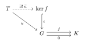
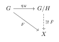
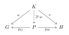

# Subgroups, Quotients, and Applications

A subgroup records a group inside a larger one, while a quotient records the
information deliberately forgotten by a homomorphism. Normality is precisely
the condition that makes this forgetting compatible with multiplication. We
develop these ideas through universal properties and the isomorphism theorems,
then apply them to permutation quotients, simple groups, Chinese remainders,
and direct products.

## Subgroups and Generated Subgroups

!!! definition "Definition (Subgroup)"
    
    A subset $H\subseteq G$ is a **subgroup**, written $H\leq G$, if it is
    a group under the operation inherited from $G$. Equivalently,

    $$
    H\neq\varnothing,
    \qquad
    xy^{-1}\in H \quad (x,y\in H).
    $$

    Indeed, taking $x=y$ gives $e\in H$, taking $x=e$ gives inverses, and
    replacing $y$ by $y^{-1}$ gives closure under products.

!!! proposition "Proposition (Subgroups supplied by maps)"
    
    Let $f:G\to K$ be a homomorphism.

    + If $H\leq G$, then $f(H)\leq K$.
    + If $L\leq K$, then $f^{-1}(L)\leq G$.

    In particular, $\operatorname{im}f\leq K$ and
    $\ker f=f^{-1}(\{e\})\leq G$.

??? proof "Proof"
    If $a=f(x)$ and $b=f(y)$ with $x,y\in H$, then
    $ab^{-1}=f(xy^{-1})\in f(H)$. If $a,b\in f^{-1}(L)$, then
    $f(ab^{-1})=f(a)f(b)^{-1}\in L$. Apply the subgroup test.

!!! proposition "Proposition (Intersections of subgroups)"
    
    Every intersection of subgroups of $G$ is a subgroup of $G$.

??? proof "Proof"
    The identity belongs to every subgroup. If $x,y$ belong to the
    intersection, then $xy^{-1}$ belongs to every subgroup in the family.

!!! definition "Definition (Generated subgroup)"
    
    For $S\subseteq G$, let

    $$
    W(S)=\{s_1^{\varepsilon_1}\cdots s_r^{\varepsilon_r}
    \mid r\geq0,\ s_i\in S,\ \varepsilon_i\in\{1,-1\}\},
    $$

    where the word of length zero is $e$. The **subgroup generated by
    $S$** is

    $$
    \langle S\rangle
    =W(S)
    =\bigcap_{\substack{H\leq G\\S\subseteq H}}H.
    $$

    It is characterized by
    $\langle S\rangle\leq H\iff S\subseteq H$.

??? proof "Proof"
    The subgroup test shows that $W(S)$ is a subgroup containing $S$.
    Every subgroup containing $S$ contains every word in $S$, hence
    contains $W(S)$. This proves both descriptions and minimality.

!!! remark "Remark (Universal meaning of a kernel)"
    
    Let $f:G\to K$ be a homomorphism, let
    $i:\ker f\hookrightarrow G$ be the inclusion, and write
    $0:G\to K$ for the trivial homomorphism. For every group $T$ and
    homomorphism $u:T\to G$ satisfying $f\circ u=0$, there is a unique
    homomorphism $\widetilde u:T\to\ker f$ such that
    $i\circ\widetilde u=u$.

    { .commutative-diagram  style="--mn-diagram-width: 14rem" }

    Thus $(\ker f,i)$ is the equalizer of $f$ and $0$: it is the
    universal subgroup of $G$ on which $f$ vanishes.

!!! definition "Definition (Cyclic group)"
    
    A group $G$ is **cyclic** if $G=\langle g\rangle$ for some
    $g\in G$; such an element $g$ is called a **generator** of $G$.
    For $g\in G$, the map $\mathbb Z\to G$, $m\mapsto g^m$, has image
    $\langle g\rangle$. Its kernel is $0$ when $g$ has infinite order and
    $n\mathbb Z$ when $\operatorname{ord}(g)=n$. The
    [first isomorphism theorem](#thm-first-isomorphism) therefore gives
    $\langle g\rangle\cong\mathbb Z$ or
    $\langle g\rangle\cong\mathbb Z/n\mathbb Z$.

## Cosets, Counting, and Normality

!!! definition "Definition (Cosets and index)"
    
    For $H\leq G$, define

    $$
    x\sim_H y \iff x^{-1}y\in H.
    $$

    This is an equivalence relation. The class of $x$ is the **left
    coset** $xH=\{xh\mid h\in H\}$, and
    $G/H=\{xH\mid x\in G\}$ is the set of left cosets.
    
    A **right coset** has the form
    $Hx=\{hx\mid h\in H\}$.
    
    The cardinality of $G/H$
    is the **index** of $H$ in $G$, written
    $[G:H]:=|G/H|$.

!!! proposition "Proposition (Coset calculus)"
    
    For $x,y\in G$,

    $$
    xH=yH
    \iff x^{-1}y\in H
    \iff y\in xH.
    $$

    Hence left cosets are equal or disjoint, $xH=H$ exactly when
    $x\in H$, and the map $h\mapsto xh$ is a bijection $H\to xH$.
    Inversion gives a bijection $xH\to Hx^{-1}$.

??? proof "Proof"
    If $x^{-1}y=h\in H$, then $y=xh$ and $yH=xH$. Conversely,
    $y\in xH$ gives $x^{-1}y\in H$. The remaining assertions follow
    immediately.

!!! remark "Remark (Universal property of the "coset set" as a quotient set)"
    
    Let $H\leq G$, let $X$ be any set. Write
    $q_H:G\to G/H$ for $g\mapsto gH$. A function $F:G\to X$ factors
    uniquely through $q_H$ if and only if
    $F(x)=F(y)$ whenever $xH=yH$. In that case $\bar F(gH)=F(g)$.

    { .commutative-diagram style="--mn-diagram-width: 9rem" }

    Thus $q_H$ is the quotient map for the equivalence relation
    $x\sim_H y$ in the category of sets.

??? proof "Proof"
    Constancy on cosets makes $\bar F(gH)=F(g)$ well-defined, and then
    $F=\bar F\circ q_H$. Surjectivity of $q_H$ forces uniqueness. The
    converse follows from $q_H(x)=q_H(y)$ whenever $xH=yH$.

!!! theorem "Theorem (Lagrange)"
    
    If $G$ is finite and $H\leq G$, then

    $$
    |G|=|G/H|\,|H|.
    $$

    Consequently, the order of every subgroup and every element divides
    $|G|$; in particular, $g^{|G|}=e$ for every $g\in G$.

??? proof "Proof"
    The left cosets partition $G$, and left multiplication gives a
    bijection $H\to xH$. Thus all $|G/H|$ blocks have $|H|$ elements.
    Apply the result to $\langle g\rangle$ for the element-order claim.

!!! corollary "Corollary (Groups of prime order)"
    
    Recall that the [order of a group](integers-groups-and-homomorphisms.md#def-powers-order)
    is its cardinality $|G|$.
 

    Every group of prime order is [cyclic](#def-cyclic-group); in fact,
    every nonidentity element is a generator.

??? proof "Proof"
    If $|G|=p$ and $g\neq e$, then $\operatorname{ord}(g)$ divides $p$
    and is greater than $1$. Hence $\operatorname{ord}(g)=p$, so
    $G=\langle g\rangle$.

!!! proposition "Proposition (Index-tower formula)"
    
    If $H\leq K\leq G$ and $[G:K]$ and
    $[K:H]$ are finite, then

    $$
    [G:H]=[G:K][K:H],
    $$

    equivalently $|G/H|=|G/K|\,|K/H|$.

??? proof "Proof"
    If $G$ is finite, Lagrange gives the immediate calculation

    $$
    |G/H|=\frac{|G|}{|H|}
    =\frac{|G|}{|K|}\frac{|K|}{|H|}
    =|G/K|\,|K/H|.
    $$

    The stated hypothesis also allows $G$ to be infinite, so cardinality
    division is not available in general. Choose representatives $t_i$ of
    the left cosets of $K$ in $G$ and representatives $u_j$ of the left
    cosets of $H$ in $K$. Then the products $t_i u_j$ represent the left
    cosets of $H$ in $G$; existence and uniqueness follow first modulo
    $K$, then modulo $H$.

!!! definition "Definition (Normal subgroup)"
    
    A subgroup $N\leq G$ is **normal**, written $N\trianglelefteq G$, if

    $$
    gNg^{-1}=N \qquad (g\in G).
    $$

!!! proposition "Proposition (Equivalent forms of normality)"
    
    For $N\leq G$, the following are equivalent:

    + $N\trianglelefteq G$;
    + $gng^{-1}\in N$ for every $g\in G$ and $n\in N$;
    + $gN=Ng$ for every $g\in G$;
    + the collections of left and right cosets of $N$ coincide.

??? proof "Proof"
    The inclusion $gNg^{-1}\subseteq N$, applied also to $g^{-1}$,
    forces equality. Multiplying by $g$ gives $gN=Ng$, and the steps are
    reversible. If left and right cosets form the same partition, $gN$
    and $Ng$ are the unique blocks containing $g$, hence are equal.

!!! proposition "Proposition (Normal subgroups and homomorphisms)"
    
    Let $f:G\to K$ be a group homomorphism. Then
    $\ker f\trianglelefteq G$. More generally, if
    $L\trianglelefteq K$, then $f^{-1}(L)\trianglelefteq G$. If, in
    addition, $f$ is surjective and $N\trianglelefteq G$, then
    $f(N)\trianglelefteq K$.

??? proof "Proof"
    Each statement follows by applying $f$ to a conjugate. For the image
    statement, write every $k\in K$ as $f(g)$; this is where surjectivity
    is used.

!!! example "Example (Normal does not mean central)"
    
    Every subgroup of an abelian group is normal. In $S_3$,
    $\langle(12)\rangle$ is not normal because conjugation by $(123)$
    gives $\langle(23)\rangle$. The subgroup
    $A_3=\langle(123)\rangle$ is normal, but conjugation by $(12)$ sends
    $(123)$ to $(132)$; normality preserves a subgroup as a set, not each
    of its elements.

## Quotient Groups and Universal Properties

!!! theorem "Theorem (Quotient-group criterion)"
    
    Let $H\leq G$. The formula

    $$
    (gH)(kH)=(gk)H
    $$

    defines a group operation on $G/H$ if and only if
    $H\trianglelefteq G$. When this holds, the projection
    $q:G\to G/H$, $g\mapsto gH$, is a surjective homomorphism with
    $\ker q=H$.

??? proof "Proof"
    Suppose $H=N\trianglelefteq G$. If $g'=gn_1$ and $k'=kn_2$, then

    $$
    g'k'=gn_1kn_2=gk(k^{-1}n_1k)n_2\in gkN,
    $$

    so the product is independent of representatives. Associativity
    descends from $G$, the identity is $N$, and
    $(gN)^{-1}=g^{-1}N$.

    Conversely, if multiplication is well-defined and $h\in H$, then
    $hH=H$. Hence
    $(gH)(hH)(g^{-1}H)=ghg^{-1}H=H$, so $ghg^{-1}\in H$.

!!! remark "Remark (Calculation in a quotient)"
    
    For $N\trianglelefteq G$,

    $$
    gN=hN\iff g^{-1}h\in N,
    \qquad
    (gN)(hN)=ghN,
    \qquad
    (gN)^{-1}=g^{-1}N.
    $$

    Moreover, $(gN)^m=g^mN$ and
    $\operatorname{ord}(gN)=\min\{m>0\mid g^m\in N\}$ when this order is
    finite. If $G$ is finite, then $|G/N|=|G|/|N|$.

!!! definition "Definition (Group congruence)"
    
    An equivalence relation $\sim$ on $G$ is a **group congruence** if
    $x\sim x'$, $y\sim y'$ imply

    $$
    xy\sim x'y',
    \qquad
    x^{-1}\sim(x')^{-1}.
    $$

!!! proposition "Proposition (Normal subgroups and congruences)"
    
    Normal subgroups of $G$ correspond bijectively to group congruences.
    The correspondence sends $N\trianglelefteq G$ to
    $x\sim_Ny\iff x^{-1}y\in N$, and sends a congruence to the class of
    $e$.

??? proof "Proof"
    If $N\trianglelefteq G$, compatibility with products follows from

    $$
    (xx')^{-1}(yy')=x'^{-1}(x^{-1}y)x'(x'^{-1}y')\in N,
    $$

    and compatibility with inverses follows by conjugating. Conversely,
    the class $N=[e]$ passes the subgroup test, and compatibility gives
    $gng^{-1}\sim e$ for $n\in N$. Finally,
    $x\sim y$ exactly when $x^{-1}y\sim e$.

!!! theorem "Theorem (Universal property of a quotient)"
    
    Let $N\trianglelefteq G$ and $q:G\to G/N$ be the projection. For a
    homomorphism $f:G\to K$, the following are equivalent:

    + $N\subseteq\ker f$;
    + there is a unique homomorphism $\bar f:G/N\to K$ such that
      $f=\bar f\circ q$.

    When it exists, $\bar f(gN)=f(g)$.

    { .commutative-diagram style="--mn-diagram-width: 9rem" }

??? proof "Proof"
    A factorization kills $N$ because $q(N)=\{N\}$. Conversely, if
    $N\subseteq\ker f$ and $gN=hN$, then $h^{-1}g\in N$, so
    $f(g)=f(h)$. Thus $\bar f(gN)=f(g)$ is well-defined and is a
    homomorphism. Surjectivity of $q$ forces uniqueness.

!!! remark "Remark (Categorical form)"
    
    If $i:N\hookrightarrow G$ and $0:N\to G$ is the trivial map, then
    $q:G\to G/N$ is the coequalizer of $i$ and $0$, equivalently the
    cokernel of $i$ in the category of groups. Thus $G/N$ forces every
    $n\in N$ to equal $e$ and introduces no further identifications.

!!! example "Example (Universal meaning of $\mathbb Z/n\mathbb Z$)"
    
    A homomorphism $f:\mathbb Z\to K$ is determined by $k=f(1)$. It
    factors through $\mathbb Z/n\mathbb Z$ exactly when
    $n\mathbb Z\subseteq\ker f$, equivalently $k^n=e$. Thus
    $\mathbb Z/n\mathbb Z$ is universal among groups with a chosen element
    whose order divides $n$.

!!! definition "Definition (Normal closure)"
    
    For $S\subseteq G$, its **normal closure** is

    $$
    \langle\!\langle S\rangle\!\rangle
    =\bigcap_{\substack{N\trianglelefteq G\\S\subseteq N}}N.
    $$

    It is the smallest normal subgroup containing $S$, and it is generated
    as a subgroup by all conjugates $gsg^{-1}$ with $g\in G$, $s\in S$.

!!! proposition "Proposition (Universal quotient imposing relations)"
    
    For every homomorphism $f:G\to K$,

    $$
    S\subseteq\ker f
    \iff
    \langle\!\langle S\rangle\!\rangle\subseteq\ker f.
    $$

    Hence $G/\langle\!\langle S\rangle\!\rangle$ is the universal
    quotient in which every element of $S$ becomes trivial.

!!! remark "Remark (Killing a nonnormal subgroup)"
    
    If $H\leq G$ is not normal, the cokernel of $H\hookrightarrow G$ is
    not the coset set $G/H$ but the group
    $G/\langle\!\langle H\rangle\!\rangle$: killing $H$ necessarily kills
    all its conjugates.

!!! example "Example (Abelianization)"
    
    Let $[G,G]$ be generated by the commutators
    $[g,h]=ghg^{-1}h^{-1}$. Since

    $$
    x[g,h]x^{-1}=[xgx^{-1},xhx^{-1}],
    $$

    the subgroup $[G,G]$ is normal. The quotient
    $G^{\mathrm{ab}}=G/[G,G]$ is abelian. Every homomorphism from $G$ to
    an abelian group kills all commutators and therefore factors uniquely
    through $G^{\mathrm{ab}}$.

## Isomorphism Theorems and Exact Sequences

!!! theorem "Theorem (First isomorphism theorem)"
    
    For every homomorphism $f:G\to K$, the rule

    $$
    \widetilde f:G/\ker f\longrightarrow\operatorname{im}f,
    \qquad
    g\ker f\longmapsto f(g)
    $$

    is a canonical isomorphism. Thus $f$ factors as

    $$
    G\longrightarrow G/\ker f
    \xrightarrow{\sim}\operatorname{im}f
    \hookrightarrow K.
    $$

??? proof "Proof"
    The quotient universal property gives $\widetilde f$. It is
    surjective by definition of the image. If
    $\widetilde f(g\ker f)=e$, then $g\in\ker f$, so its kernel is
    trivial and it is injective.

!!! corollary "Corollary (Normal subgroups are kernels)"
    
    A subgroup $N\leq G$ is normal if and only if it is the kernel of some
    homomorphism; namely, $N=\ker(G\to G/N)$.

!!! example "Example (Determinant quotient)"
    
    For a field $F$, the determinant
    $\det:\operatorname{GL}_n(F)\to F^\times$ is surjective with kernel
    $\operatorname{SL}_n(F)$. Hence

    $$
    \operatorname{GL}_n(F)/\operatorname{SL}_n(F)\cong F^\times.
    $$

!!! definition "Definition (Short exact sequence)"
    
    A diagram

    $$
    1\longrightarrow N\xrightarrow{i}G\xrightarrow{p}Q
    \longrightarrow1
    $$

    is a **short exact sequence** if $i$ is injective, $p$ is surjective,
    and $\operatorname{im}i=\ker p$. After identifying $N$ with its image,
    the first isomorphism theorem gives $Q\cong G/N$.

!!! remark "Remark (Extension data)"
    
    A short exact sequence describes $G$ as built from a normal subgroup
    $N$ and quotient $Q$, but the abstract groups $N,Q$ do not determine
    $G$. The missing assembly data leads to group actions and semidirect
    products.

!!! theorem "Theorem (Correspondence theorem)"
    
    Let $N\trianglelefteq G$. The assignments

    $$
    L\longmapsto L/N,
    \qquad
    \mathcal L\longmapsto q^{-1}(\mathcal L)
    $$

    are inverse inclusion-preserving bijections between subgroups
    $L\leq G$ containing $N$ and subgroups $\mathcal L\leq G/N$. They
    preserve normality and indices:

    $$
    L\trianglelefteq G\iff L/N\trianglelefteq G/N,
    \qquad
    |G/L|=|(G/N)/(L/N)|.
    $$

??? proof "Proof"
    Surjectivity of $q$ gives $q(q^{-1}(\mathcal L))=\mathcal L$. If
    $N\subseteq L$, then $q^{-1}(q(L))=LN=L$. Conjugating cosets proves
    preservation of normality, and $gL\mapsto(gN)(L/N)$ is a bijection of
    coset sets.

!!! theorem "Theorem (Third isomorphism theorem)"
    
    If $N\subseteq K$ and $N,K\trianglelefteq G$, then
    $K/N\trianglelefteq G/N$ and

    $$
    (G/N)/(K/N)\cong G/K.
    $$

??? proof "Proof"
    The map $G/N\to G/K$, $gN\mapsto gK$, is a well-defined surjective
    homomorphism with kernel $K/N$. Apply the first isomorphism theorem.

!!! theorem "Theorem (Second isomorphism theorem)"
    
    If $H\leq G$ and $N\trianglelefteq G$, then $HN\leq G$,
    $H\cap N\trianglelefteq H$, and

    $$
    H/(H\cap N)\cong HN/N.
    $$

??? proof "Proof"
    Normality gives $HN=NH$, which implies that $HN$ is a subgroup.
    Also $H\cap N\trianglelefteq H$. Restrict $q:G\to G/N$ to $H$:

    $$
    H\longrightarrow HN/N,
    \qquad h\longmapsto hN.
    $$

    It is surjective with kernel $H\cap N$, so the first isomorphism
    theorem applies.

!!! example "Example (Second isomorphism theorem in $S_3$)"
    
    For $H=\langle(12)\rangle$ and $N=A_3$ in $S_3$, one has
    $H\cap N=\{e\}$ and $HN=S_3$. Hence
    $\langle(12)\rangle\cong S_3/A_3\cong C_2$.

## Products and Quotient Applications

!!! definition "Definition (Product of groups)"
    
    A **product** of groups $G,H$ is a group $P$ with homomorphisms
    $p_G:P\to G$ and $p_H:P\to H$ such that, for every group $K$ and
    homomorphisms $u:K\to G$, $v:K\to H$, there is a unique homomorphism
    $w:K\to P$ satisfying $p_G\circ w=u$ and $p_H\circ w=v$.

    { .commutative-diagram style="--mn-diagram-width: 13rem" }

!!! proposition "Proposition (Construction of the product)"
    
    The Cartesian set $G\times H$, with

    $$
    (g,h)(g',h')=(gg',hh'),
    $$

    and the coordinate projections is a product of $G,H$.

??? proof "Proof"
    Coordinatewise multiplication makes $G\times H$ a group with identity
    $(e_G,e_H)$ and inverse $(g,h)^{-1}=(g^{-1},h^{-1})$. Given
    $u:K\to G$ and $v:K\to H$, define
    $w(k)=(u(k),v(k))$. This is a homomorphism with the required
    projections, and those projections determine both coordinates of any
    possible $w$, proving uniqueness.

!!! proposition "Proposition (Uniqueness of products)"
    
    If $(P,p_G,p_H)$ and $(Q,q_G,q_H)$ are products of $G,H$, there is a
    unique isomorphism $\theta:P\to Q$ such that
    $q_G\circ\theta=p_G$ and $q_H\circ\theta=p_H$.

??? proof "Proof"
    The universal property of $Q$ gives $\theta:P\to Q$; that of $P$
    gives $\eta:Q\to P$. Both $\eta\theta$ and $\operatorname{id}_P$ have
    projections $p_G,p_H$, so uniqueness gives
    $\eta\theta=\operatorname{id}_P$. Similarly
    $\theta\eta=\operatorname{id}_Q$.

!!! proposition "Proposition (Finite-index core criterion)"
    
    Let $H\leq G$ have finite index $n$, and define

    $$
    \operatorname{Core}_G(H)=\bigcap_{x\in G}xHx^{-1}.
    $$

    Left multiplication on cosets gives a homomorphism

    $$
    \rho_H:G\longrightarrow\operatorname{Sym}(G/H)\cong S_n,
    \qquad
    \rho_H(g)(xH)=gxH,
    $$

    with kernel $\operatorname{Core}_G(H)$. The core is therefore the
    largest normal subgroup of $G$ contained in $H$, and
    $|G/\operatorname{Core}_G(H)|$ divides $n!$.

??? proof "Proof"
    The displayed rule is a permutation action and a homomorphism. Moreover,

    $$
    g\in\ker\rho_H
    \iff x^{-1}gx\in H\text{ for every }x\in G
    \iff g\in\bigcap_{x\in G}xHx^{-1}.
    $$

    Conjugation permutes the conjugates of $H$, so the core is normal. If
    $N\trianglelefteq G$ and $N\leq H$, then
    $N=xNx^{-1}\leq xHx^{-1}$ for every $x$, proving maximality. The
    divisibility follows from the first isomorphism theorem and Lagrange.

!!! corollary "Corollary (Small-index subgroups)"
    
    With the notation above:

    + $H\trianglelefteq G$ if and only if
      $\operatorname{Core}_G(H)=H$;
    + every subgroup of index $2$ is normal, with quotient $C_2$;
    + if $G$ is finite and $H$ has index $p$, where $p$ is the smallest
      prime divisor of $|G|$, then $H\trianglelefteq G$ and $G/H\cong C_p$.

??? proof "Proof"
    The first assertion is immediate. For index $2$, the index-tower
    formula and divisibility by $2!$ force the core to equal $H$. In the
    last case, the core index divides both $|G|$ and $p!$ and is a multiple
    of $p$. Minimality of $p$ gives $\gcd(|G|,p!)=p$, so the core again
    equals $H$.

!!! example "Example (Parity and orientation)"
    
    The sign homomorphism $\operatorname{sgn}:S_n\to\{\pm1\}$ is
    surjective for $n\geq2$ and has kernel $A_n$, so
    $S_n/A_n\cong C_2$. Likewise, the rotation subgroup
    $\langle r\rangle$ of
    $D_{2n}=\langle r,s\mid r^n=s^2=e,\ srs=r^{-1}\rangle$ has index
    two, and $D_{2n}/\langle r\rangle\cong C_2$. These quotients remember
    parity and orientation respectively.

!!! definition "Definition (Simple group)"
    
    A nontrivial group is **simple** if its only normal subgroups are
    $\{e\}$ and the whole group.

!!! proposition "Proposition (Simple-quotient criterion)"
    
    Let $N\trianglelefteq G$ be proper. Then $G/N$ is simple if and only
    if $N$ is maximal among the proper normal subgroups of $G$.

??? proof "Proof"
    By the correspondence theorem, normal subgroups of $G/N$ are exactly
    the groups $K/N$ with $N\subseteq K\trianglelefteq G$.

!!! remark "Remark (Prime-order quotients)"
    
    Every $C_p$ of prime order is simple. Since $S_n/A_n\cong C_2$, the
    subgroup $A_n$ is maximal among proper normal subgroups of $S_n$.
    This does not by itself assert that $A_n$ is simple; that is a deeper
    theorem for $n\geq5$.

!!! theorem "Theorem (Chinese remainder theorem for groups)"
    
    Let $N,M\trianglelefteq G$ and define

    $$
    \Phi:G\longrightarrow G/N\times G/M,
    \qquad
    g\longmapsto(gN,gM).
    $$

    Then $\ker\Phi=N\cap M$, and $\Phi$ is surjective if and only if
    $NM=G$. Consequently, if $NM=G$, then

    $$
    G/(N\cap M)\cong G/N\times G/M.
    $$

??? proof "Proof"
    The kernel is visibly $N\cap M$. If $NM=G$ and
    $(aN,bM)$ is given, write $a^{-1}b=nm$. Then
    $an=bm^{-1}$ maps to $(aN,bM)$. Conversely, if $\Phi$ is surjective
    and $g\in G$, choose $x$ with $\Phi(x)=(N,gM)$. Then $x\in N$ and
    $xM=gM$, so $g\in NM$. Apply the first isomorphism theorem.

!!! example "Example (Arithmetic CRT)"
    
    For coprime positive integers $m,n$, take
    $G=\mathbb Z$, $N=m\mathbb Z$, and $M=n\mathbb Z$. Bézout gives
    $N+M=\mathbb Z$, while $N\cap M=mn\mathbb Z$. Hence

    $$
    \mathbb Z/mn\mathbb Z
    \cong
    \mathbb Z/m\mathbb Z\times\mathbb Z/n\mathbb Z.
    $$

!!! corollary "Corollary (Internal direct-product criterion)"
    
    If $N,M\trianglelefteq G$, $N\cap M=\{e\}$, and $NM=G$, then
    multiplication is an isomorphism

    $$
    N\times M\xrightarrow{\sim}G,
    \qquad
    (n,m)\longmapsto nm.
    $$

??? proof "Proof"
    For $n\in N$ and $m\in M$, the commutator $nmn^{-1}m^{-1}$ lies in
    both $N$ and $M$, so it is trivial. Thus the factors commute and
    multiplication is a homomorphism. It is surjective because $NM=G$.
    If $nm=e$, then $n=m^{-1}\in N\cap M$, so the kernel is trivial.

!!! example "Example (Direct and semidirect behavior)"
    
    In $C_6=\mathbb Z/6\mathbb Z$, the subgroups
    $\langle\bar3\rangle\cong C_2$ and
    $\langle\bar2\rangle\cong C_3$ satisfy the criterion, giving
    $C_6\cong C_2\times C_3$. In contrast,
    $S_3=A_3\langle(12)\rangle$ with trivial intersection, but
    $\langle(12)\rangle$ is not normal; this leads to the semidirect
    product rather than a direct product.
