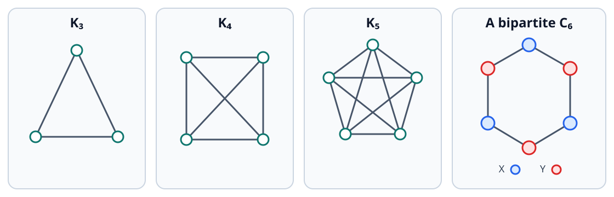
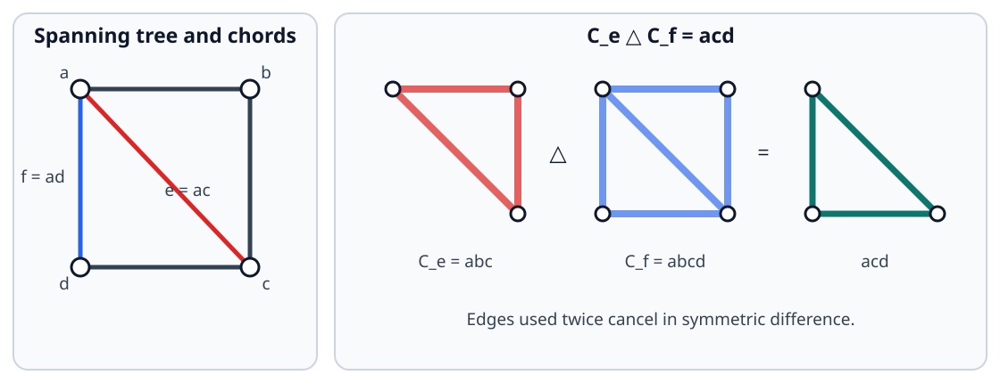
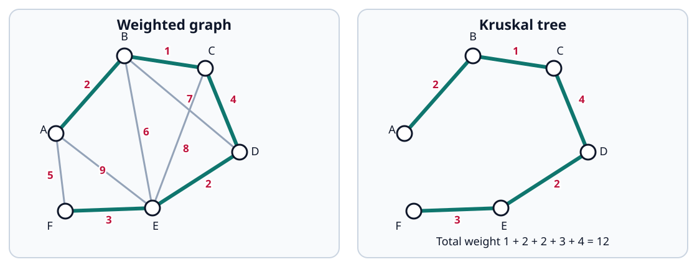
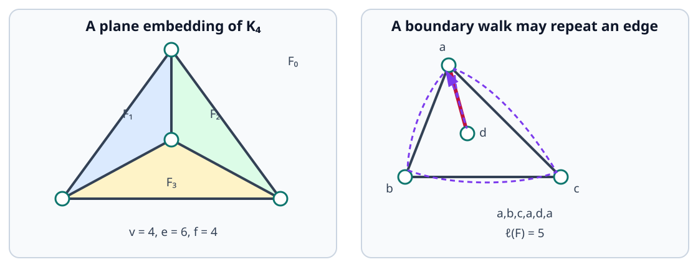
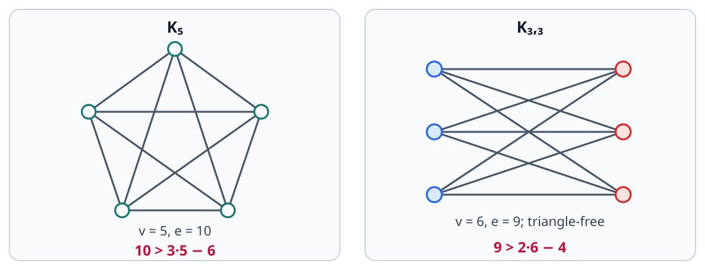
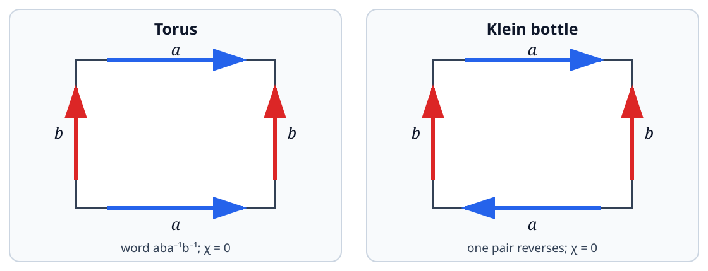
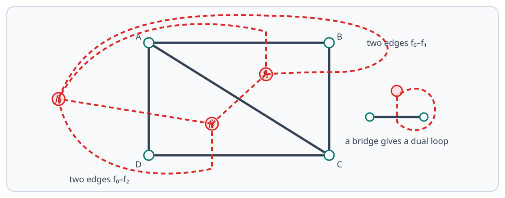
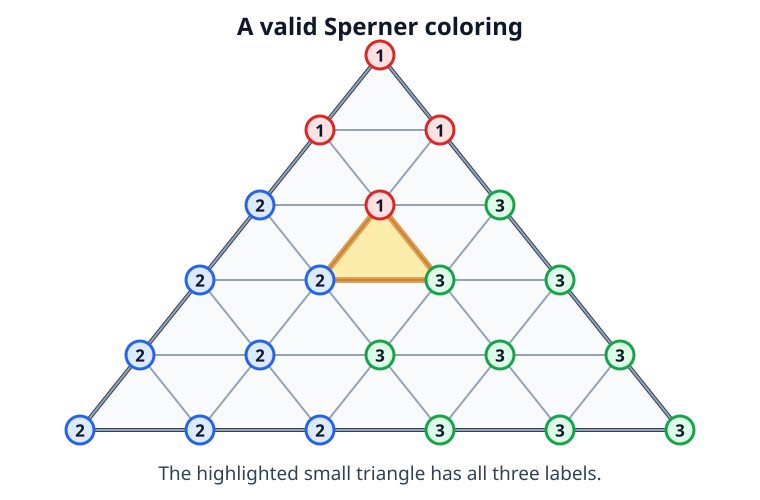

# Graph Theory

Graph theory replaces geometric detail by incidence: vertices record objects and edges record which pairs are related. The first part of this chapter develops simple graphs, trees, spanning trees, and the cycle space. The second part studies plane embeddings, Euler characteristic, planar duality, and the combinatorial route from Sperner's lemma to Brouwer's fixed-point theorem. Definitions that were used orally in class are stated explicitly, while descriptive classroom arguments are separated into `Idea` blocks.

## Graphs and Connectivity

!!! notation "Notation (Two-element subsets)"
    For a set $V$, write

    $$
    [V]^2=\{A\subseteq V:|A|=2\}.
    $$

    If $u,v\in V$ are distinct, the two-element set $\{u,v\}$ is abbreviated to $uv$.

!!! definition "Definition (Simple graph)"
    
    A **graph** is a pair $G=(V,E)$ in which $V$ is a set and $E\subseteq[V]^2$. The elements of $V=V(G)$ are the **vertices**, and the elements of $E=E(G)$ are the **edges**.

    Unless stated otherwise, every graph in this chapter is undirected and simple: it has neither loops nor parallel edges. Most of the course concerns finite graphs.

!!! definition "Definition (Adjacency, neighbourhood, and degree)"
    
    Vertices $u$ and $v$ are **adjacent** if $uv\in E(G)$. The **neighbourhood** of $v$ is

    $$
    N_G(v)=\{u\in V(G):uv\in E(G)\},
    $$

    and its **degree** is $\deg_G(v)=|N_G(v)|$. An edge and either of its endpoints are said to be **incident**.

!!! lemma "Lemma (Handshaking lemma)"
    
    If $G$ is finite, then

    $$
    \sum_{v\in V(G)}\deg_G(v)=2|E(G)|.
    $$

    Consequently, the number of vertices of odd degree is even.

??? proof "Proof"
    Count the incident pairs $(v,e)$ with $v$ an endpoint of $e$. Summing first over vertices gives the left-hand side. Summing first over edges gives $2|E(G)|$, because every edge has two endpoints. Reducing the identity modulo $2$ proves the final assertion.

!!! definition "Definition (Graph isomorphism)"
    
    Graphs $G$ and $H$ are **isomorphic**, written $G\cong H$, if there is a bijection

    $$
    \varphi:V(G)\longrightarrow V(H)
    $$

    such that, for all $u,v\in V(G)$,

    $$
    uv\in E(G)
    \quad\Longleftrightarrow\quad
    \varphi(u)\varphi(v)\in E(H).
    $$

    Thus an isomorphism may rename vertices, but it preserves every adjacency and non-adjacency.

!!! definition "Definition (Subgraphs)"
    
    A graph $H$ is a **subgraph** of $G$ if $V(H)\subseteq V(G)$ and $E(H)\subseteq E(G)$. It is a **spanning subgraph** if $V(H)=V(G)$.

    For $S\subseteq V(G)$, the **subgraph induced by $S$**, denoted $G[S]$, has vertex set $S$ and edge set

    $$
    E(G[S])=E(G)\cap[S]^2.
    $$

    The word induced is important: once $S$ is chosen, every edge of $G$ with both endpoints in $S$ must be retained.

!!! definition "Definition (Complete graphs, cliques, and independent sets)"
    
    The **complete graph** $K_n$ has $n$ vertices and all $\binom n2$ possible edges. A set $S\subseteq V(G)$ is a **clique** if $G[S]$ is complete, and it is **independent** if $G[S]$ has no edges.

<figure markdown="span">
  
  <figcaption>Complete graphs and a bipartite graph. Crossings in the drawings of $K_4$ and $K_5$ are not vertices.</figcaption>
</figure>

!!! definition "Definition (Complement)"
    
    The **complement** of $G=(V,E)$ is

    $$
    \overline G=(V,[V]^2\setminus E).
    $$

    Two distinct vertices are adjacent in $\overline G$ exactly when they are not adjacent in $G$.

!!! proposition "Proposition (Cliques and independent sets)"
    
    For every $S\subseteq V(G)$, the following are equivalent:

    1. $S$ is a clique in $G$;
    2. $S$ is an independent set in $\overline G$.

??? proof "Proof"
    The first condition says that every pair in $[S]^2$ belongs to $E(G)$. By the definition of the complement, this is equivalent to saying that no pair in $[S]^2$ belongs to $E(\overline G)$, which is the second condition.

!!! definition "Definition (Walks, trails, paths, and cycles)"
    
    A **walk of length $k$** is a sequence

    $$
    v_0,v_1,\ldots,v_k
    $$

    such that $v_{i-1}v_i\in E(G)$ for $1\le i\le k$. Vertices and edges may repeat in a walk. A **trail** is a walk with no repeated edge, and a **path** is a walk with no repeated vertex.

    A **closed walk** has $v_0=v_k$. A **cycle** is a closed walk of length $k\ge3$ for which $v_0,v_1,\ldots,v_{k-1}$ are distinct. This last distinctness condition makes precise the shorter definition used on the board.

    A **$u$--$v$ path** begins at $u$ and ends at $v$.

!!! definition "Definition (Connected graph and components)"
    
    A graph $G$ is **connected** if $V(G)\ne\varnothing$ and every two vertices are joined by a path. A **connected component** is a maximal connected induced subgraph. Equivalently, the components are the equivalence classes of the relation

    $$
    u\sim v
    \quad\Longleftrightarrow\quad
    \text{there is a $u$--$v$ path}.
    $$

!!! definition "Definition (Bipartite graph)"
    
    A graph $G$ is **bipartite** if its vertex set can be partitioned as

    $$
    V(G)=X\sqcup Y
    $$

    so that every edge has one endpoint in $X$ and the other in $Y$. The ordered pair $(X,Y)$ is a **bipartition**.

!!! theorem "Theorem (Odd-cycle criterion)"
    
    A graph is bipartite if and only if it contains no odd cycle.

??? proof "Proof"
    Suppose first that $V(G)=X\sqcup Y$ is a bipartition. Along every walk the vertices alternate between $X$ and $Y$, so a closed walk, and hence a cycle, must have even length.

    Conversely, it is enough to treat one connected component at a time. Choose a root $r$ and a breadth-first-search tree rooted at $r$. Put in $X$ the vertices whose distance from $r$ is even and in $Y$ those whose distance from $r$ is odd. If an edge $uv$ had both endpoints in the same class, take the two tree paths from $r$ to $u$ and $v$, and let $w$ be their last common vertex. The $w$--$u$ and $w$--$v$ portions, together with $uv$, form a cycle of length

    $$
    d(r,u)+d(r,v)-2d(r,w)+1,
    $$

    which is odd. This is a contradiction, so every edge crosses from $X$ to $Y$.

## Trees and Spanning Trees

!!! notation "Notation (Deleting and adding edges)"
    If $e\in E(G)$, then $G-e$ is obtained by deleting $e$ and retaining every vertex. If $u,v\in V(G)$ are non-adjacent, then $G+uv$ is obtained by adding the edge $uv$. For $x\in V(G)$, the graph $G-x$ deletes $x$ and every edge incident with $x$.

!!! definition "Definition (Trees and forests)"
    
    A **tree** is a connected graph with no cycle. A graph with no cycle is a **forest**; its connected components are trees.

!!! theorem "Theorem (Characterisations of a tree)"
    
    For a finite graph $T$ with at least one vertex, the following are equivalent:

    1. $T$ is a tree;
    2. every two vertices of $T$ are joined by a unique path;
    3. $T$ is connected and deleting any edge disconnects it;
    4. $T$ is acyclic and adding any missing edge creates exactly one cycle.

??? proof "Proof"
    If $T$ is connected and acyclic, at least one path joins any two vertices. Two distinct such paths would separate and later meet again, producing a cycle, so the path is unique.

    Under unique paths, an edge $uv$ is the unique $u$--$v$ path, so deleting it disconnects $u$ from $v$. Conversely, if $T$ is connected and every edge deletion disconnects it, no edge can lie on a cycle, because the remaining edges of that cycle would still join its endpoints.

    Assume next that $T$ is connected and deleting any edge disconnects it. As already observed, this forces $T$ to be acyclic. If $uv$ is a missing edge, the connected graph $T$ contains a $u$--$v$ path; acyclicity makes that path unique. Hence $T+uv$ contains exactly one cycle, namely that path together with $uv$.

    Conversely, suppose $T$ is acyclic and adding every missing edge creates exactly one cycle. Vertices in distinct components cannot exist, because adding an edge between two components would create no cycle. Thus $T$ is connected, so it is a tree.

!!! definition "Definition (Bridge)"
    
    An edge $e$ of a graph $G$ is a **bridge** if $G-e$ has more connected components than $G$.

!!! proposition "Proposition (Bridges and cycles)"
    
    An edge is a bridge if and only if it belongs to no cycle.

??? proof "Proof"
    If $e=uv$ lies on a cycle, the rest of that cycle is a $u$--$v$ path in $G-e$, so deleting $e$ cannot separate vertices that were previously connected. If $e$ lies on no cycle and $u$ and $v$ were still connected in $G-e$, a $u$--$v$ path in $G-e$ together with $e$ would be a cycle.

!!! proposition "Proposition (Edge count in a forest)"
    
    A finite forest with $v$ vertices and $c$ connected components has exactly

    $$
    v-c
    $$

    edges. In particular, a tree on $v$ vertices has $v-1$ edges.

??? proof "Proof"
    A nontrivial finite tree has a leaf: take a longest path; an endpoint cannot have a neighbour outside the path and cannot have a second neighbour on the path without creating a cycle. Delete a leaf and its unique incident edge, then induct on the number of vertices. Summing the formula $|E(T_i)|=|V(T_i)|-1$ over the $c$ tree components gives $e=v-c$.

!!! definition "Definition (Spanning tree)"
    
    A **spanning tree** of a graph $G$ is a spanning subgraph that is a tree.

!!! proposition "Proposition (Existence of spanning trees)"
    
    Every finite connected graph has a spanning tree.

??? proof "Proof"
    Begin with $G$ and repeatedly delete one edge from a cycle. Such a deletion preserves connectedness. Since the graph is finite, the process stops; the final spanning subgraph is connected and contains no cycle.

!!! proposition "Proposition (Trees are bipartite)"
    
    Every tree is bipartite.

??? proof "Proof"
    A tree contains no cycle, so in particular it contains no odd cycle. Apply the [odd-cycle criterion](#thm-bipartite-odd-cycle). Equivalently, choose a root and separate vertices according to the parity of their distance from it.

**Fundamental cycles and even edge sets.**

!!! definition "Definition (Fundamental cycle)"
    
    Let $G$ be connected and let $T$ be a spanning tree. For every non-tree edge $a=uv\in E(G)\setminus E(T)$, the graph $T+a$ contains exactly one cycle. It is the **fundamental cycle** $C_a$ of $a$ with respect to $T$.

!!! proposition "Proposition (Fundamental-cycle exchange)"
    
    If $b\in E(C_a)\setminus\{a\}$, then $(T+a)-b$ is another spanning tree of $G$.

??? proof "Proof"
    Removing $b$ destroys the only cycle in $T+a$, so the result is acyclic. The remaining part of $C_a$ still joins the endpoints of $b$, so removing $b$ does not disconnect the graph. The vertex set is unchanged; hence the result is a spanning tree.

!!! definition "Definition (Symmetric difference and even edge set)"
    
    The **symmetric difference** of sets is

    $$
    A\mathbin\triangle B=(A\setminus B)\cup(B\setminus A).
    $$

    More generally, $A_1\triangle\cdots\triangle A_m$ consists of the elements belonging to an odd number of the $A_i$. Symmetric difference is associative.

    A set $S\subseteq E(G)$ is **even** if every vertex has even degree in the spanning subgraph $(V(G),S)$. The empty set and the edge set of every cycle are even. The symmetric difference of two even edge sets is even.

<figure markdown="span">
  
  <figcaption>Each non-tree edge determines one fundamental cycle; edges occurring twice cancel under symmetric difference.</figcaption>
</figure>

!!! theorem "Theorem (Fundamental cycle basis)"
    
    Let $G$ be a finite connected graph and $T$ a spanning tree. Every even edge set $S\subseteq E(G)$ has the unique expression

    $$
    S=\mathop{\triangle}_{a\in S\setminus E(T)}E(C_a).
    $$

??? proof "Proof"
    Put $J=S\setminus E(T)$ and define

    $$
    R=S\mathbin\triangle
    \mathop{\triangle}_{a\in J}E(C_a).
    $$

    Each fundamental cycle $C_a$ contains exactly one edge outside $T$, namely $a$. Thus every edge of $J$ is cancelled exactly once, and no new non-tree edge appears; hence $R\subseteq E(T)$. Both $S$ and all $E(C_a)$ are even, so $R$ is even.

    If $R$ were nonempty, some connected component of $(V(G),R)$ would be a nontrivial finite tree. Such a tree has a leaf, giving a vertex of degree $1$ in $(V(G),R)$, contrary to evenness. Therefore $R=\varnothing$, proving existence.

    For uniqueness, if $S=\triangle_{a\in J'}E(C_a)$, then the non-tree edges on the right are precisely the members of $J'$. Hence $J'=S\setminus E(T)=J$.

!!! corollary "Corollary (Dimension of the cycle space)"
    
    Under symmetric difference, the even edge sets form a vector space over $\mathbb F_2$. If $G$ has $v$ vertices and $e$ edges, then

    $$
    \{E(C_a):a\in E(G)\setminus E(T)\}
    $$

    is a basis of size $e-v+1$. Consequently, $G$ has exactly

    $$
    2^{e-v+1}
    $$

    even edge sets.

**Minimum spanning trees.**

!!! definition "Definition (Weighted graph and minimum spanning tree)"
    
    A **weighted graph** has a real weight $w(e)$ assigned to each edge. The weight of a spanning tree $T$ is

    $$
    w(T)=\sum_{e\in E(T)}w(e).
    $$

    A **minimum spanning tree** is a spanning tree of least total weight.

!!! theorem "Theorem (Kruskal's algorithm)"
    
    For a finite connected weighted graph, the following algorithm returns a minimum spanning tree.

    1. List the edges in nondecreasing order of weight.
    2. Start with the edgeless spanning forest $F=(V(G),\varnothing)$.
    3. Process the edges in that order. Add $uv$ precisely when $u$ and $v$ lie in different components of the current forest.
    4. Return $F$.

??? proof "Proof"
    At every stage, $F$ is a forest, since an edge is added only between different components. When the algorithm ends, $F$ is connected: otherwise, because $G$ is connected, some edge of $G$ joins two final components, and that edge would have been added when it was processed. Thus $F$ is a spanning tree.

    It remains to prove minimality. Maintain the invariant that the current forest $F$ is contained in some minimum spanning tree $M$. This is true initially. Suppose the algorithm adds $a=uv$. If $a\in E(M)$ there is nothing to prove. Otherwise $M+a$ contains a unique cycle. Let $S$ be the vertex set of the component of $F$ containing $u$. The $u$--$v$ path in $M$ crosses from $S$ to its complement, so the cycle contains an edge $b$ crossing the same cut. The edge $b$ could not have been processed before $a$: had it been processed, its endpoints, which are still in different components of $F$, would have caused it to be added. Hence $w(a)\le w(b)$. By the fundamental-cycle exchange,

    $$
    M'=(M+a)-b
    $$

    is a spanning tree, contains $F+a$, and satisfies $w(M')\le w(M)$. Since $M$ was minimum, $M'$ is minimum. The invariant follows by induction, and the final $F$ is therefore minimum.

<figure markdown="span">
  
  <figcaption>Kruskal selects the edges of weights $1,2,2,3,4$; every rejected edge would close a cycle.</figcaption>
</figure>

**Two structural properties of trees.**

!!! proposition "Proposition (Tree centroid)"
    
    If $T$ is a finite tree on $n$ vertices, there is a vertex $x$ such that every component of $T-x$ has at most $n/2$ vertices.

??? proof "Proof"
    Start at any vertex $x$. If some component of $T-x$ has more than $n/2$ vertices, move from $x$ to the unique neighbour lying in that component. After the move, the component containing the old vertex has fewer than $n/2$ vertices. Moreover, the size of the largest component in the direction of motion strictly decreases. The process therefore terminates, and at its terminal vertex no component has more than $n/2$ vertices.

!!! theorem "Theorem (Helly property for subtrees)"
    
    Let $\mathcal S$ be a nonempty finite family of subtrees of a tree $T$. If every two members of $\mathcal S$ share a vertex, then all members share a vertex.

??? proof "Proof"
    Root $T$ at an arbitrary vertex $r$. For each $S\in\mathcal S$, let $x_S$ be the vertex of $S$ closest to $r$, and choose $S_0$ so that $x_{S_0}$ is as far from $r$ as possible. We claim that $x_{S_0}$ belongs to every $S$.

    Choose $y\in S\cap S_0$. Because a connected subgraph of a tree contains the unique path between any two of its vertices, both $x_S$ and $x_{S_0}$ lie on the $r$--$y$ path. The choice of $S_0$ puts $x_{S_0}$ no closer to $r$ than $x_S$. Hence $x_{S_0}$ lies on the $x_S$--$y$ path, which is contained in $S$. Thus $x_{S_0}\in S$ for every $S$.

## Planar and Euler's Formula

!!! definition "Definition (Drawing, planar graph, and plane graph)"
    
    A **drawing** of a graph in the plane assigns a distinct point to every vertex and a simple arc to every edge, with the correct endpoints and with no vertex in the interior of an edge.

    A drawing is **crossing-free** if the interiors of distinct edges are disjoint. A graph is **planar** if it has a crossing-free drawing. A **plane graph** is a planar graph together with one fixed crossing-free drawing.

    Thus planarity is a property of an abstract graph, whereas faces and geometric duals belong to a chosen plane embedding.

!!! definition "Definition (Faces and boundary walks)"
    
    The **faces** of a plane graph are the connected components of the complement of its drawing in the plane. The unbounded component is the **outer face**.

    Tracing the edge-sides incident with a face gives its **boundary walk**. Its length $\ell(F)$ counts edge occurrences, not merely distinct edges. In particular, a bridge is encountered twice along the boundary of the same face.

<figure markdown="span">
  
  <figcaption>The plane $K_4$ has four faces. In the second graph the bridge $ad$ is traversed twice, so the indicated face has boundary walk $a,b,c,a,d,a$ of length $5$.</figcaption>
</figure>

!!! theorem "Theorem (Euler's formula)"
    
    If a finite connected plane graph has $v$ vertices, $e$ edges, and $f$ faces, then

    $$
    v-e+f=2.
    $$

??? proof "Proof"
    If the graph is a tree, then $e=v-1$ and there is one face, so $v-e+f=2$. Otherwise choose an edge on a cycle. Deleting that edge preserves connectedness and merges the two faces on its sides. Thus both $e$ and $f$ decrease by $1$, while $v-e+f$ is unchanged. Repeating the operation eventually produces a spanning tree, where the formula is known.

!!! corollary "Corollary (Disconnected Euler formula)"
    
    If a finite plane graph has $c$ connected components, then

    $$
    v-e+f=1+c.
    $$

??? proof "Proof"
    Draw $c-1$ additional noncrossing edges to join the components. These edges do not divide faces, so the resulting connected plane graph has $v$ vertices, $e+c-1$ edges, and $f$ faces. Euler's formula gives the result.

!!! remark "Remark (Loops and parallel edges)"
    
    Euler's formula also holds for connected plane multigraphs with loops and parallel edges. Such objects appear naturally as planar duals even when the original graph is simple.

!!! lemma "Lemma (Face handshaking)"
    
    For a finite plane graph,

    $$
    \sum_F\ell(F)=2e.
    $$

??? proof "Proof"
    Every edge has two sides. Each side is incident with one face and contributes one occurrence to that face's boundary walk. A bridge has the same face on both sides and is therefore counted twice in that one boundary walk.

!!! lemma "Lemma (Planar edge bounds)"
    
    Let $G$ be a finite simple planar graph with $v\ge3$ vertices and $e$ edges.

    First,

    $$
    e\le3v-6.
    $$

    If $G$ is triangle-free, then

    $$
    e\le2v-4.
    $$

??? proof "Proof"
    Components may be joined by new edges drawn through the outer face, so it is enough to prove the bounds for a connected plane graph. Simplicity and $v\ge3$ imply that every face boundary has length at least $3$. Hence $3f\le2e$. Combining this with $v-e+f=2$ gives $e\le3v-6$.

    If $G$ has no triangle, every face boundary has length at least $4$, so $4f\le2e$. Euler's formula now gives $e\le2v-4$.

!!! proposition "Proposition (The two basic nonplanar graphs)"
    
    The graphs $K_5$ and $K_{3,3}$ are not planar.

??? proof "Proof"
    The graph $K_5$ has $v=5$ and $e=10$, but a simple planar graph on five vertices has at most $3v-6=9$ edges.

    The graph $K_{3,3}$ is bipartite and hence triangle-free. It has $v=6$ and $e=9$, but a triangle-free simple planar graph on six vertices has at most $2v-4=8$ edges.

<figure markdown="span">
  
  <figcaption>The two edge bounds certify that $K_5$ and $K_{3,3}$ are nonplanar.</figcaption>
</figure>

!!! definition "Definition (Subdivision)"
    
    **Subdividing** an edge $uv$ replaces it by a path from $u$ to $v$ whose internal vertices are new and have degree $2$. A graph obtained by repeatedly subdividing edges of $H$ is a **subdivision of $H$**.

!!! theorem "Theorem (Kuratowski)"
    
    A finite graph is planar if and only if it contains no subgraph that is a subdivision of $K_5$ or $K_{3,3}$.

!!! remark "Remark"
    The theorem was stated without proof in class. Its content is much stronger than the edge bounds: a graph may satisfy both numerical bounds and still be nonplanar, while Kuratowski's theorem gives an exact structural obstruction.

**Euler characteristic on other surfaces.**

!!! definition "Definition (Cellular embedding)"
    
    An embedding of a graph in a surface is **cellular** if every face is homeomorphic to an open disk. For a cellular embedding, the number

    $$
    \chi=v-e+f
    $$

    depends only on the surface and is its **Euler characteristic**.

!!! theorem "Theorem (Torus and Klein bottle)"
    
    A finite connected graph cellularly embedded in the torus or the Klein bottle satisfies

    $$
    v-e+f=0.
    $$

??? idea "Idea"
    Cut the surface along a fundamental polygon, refine the embedded graph where it meets the cut, and apply the planar Euler formula before identifying opposite sides again. The identifications cancel the boundary contribution and leave Euler characteristic $0$.

    In the particular torus cut drawn on the board, the refinement and cutting changed the counts by

    $$
    v\longmapsto v+5,
    \qquad
    e\longmapsto e+4,
    \qquad
    f\longmapsto f+1.
    $$

    The cut-open drawing is planar, so

    $$
    (v+5)-(e+4)+(f+1)=2,
    $$

    and therefore $v-e+f=0$. These increments belong to that chosen cut and subdivision; they are not a universal rule for every drawing.

    The board also gave a triangulation count. Both the torus and the Klein bottle admit flat polygonal models. In a triangulation, $3f=2e$. The total angle around all vertices is $2\pi v$, while the sum of the angles of all triangular faces is $\pi f$, so $f=2v$. These two equalities give $v-e+f=0$. This is an explanatory geometric argument; making it a formal proof requires specifying a compatible triangulation and the flat metric.

<figure markdown="span">
  
  <figcaption>Opposite sides are identified according to the arrows. Both surfaces have Euler characteristic $0$.</figcaption>
</figure>

!!! remark "Remark (Why cellularity matters)"
    
    A single noncontractible loop on a torus has $v=e=f=1$ if its annular complement is incorrectly counted as one face, giving $v-e+f=1$. The apparent failure comes from the fact that the complement is an annulus, not an open disk, so the embedding is not cellular.

    The flat angle count also explains the classroom question about other surfaces. A sphere has $\chi=2$, and an orientable surface with two handles has $\chi=-2$; neither admits the same nonsingular flat angle bookkeeping. Curvature supplies the missing Euler-characteristic term.

!!! example "Example (Board embeddings)"
    
    Two torus drawings recorded on the board had

    $$
    (v,e,f)=(3,5,2)
    \qquad\text{and}\qquad
    (v,e,f)=(6,11,5).
    $$

    Both satisfy $v-e+f=0$. A separate classroom drawing with the displayed count $(4,6,2)$ appeared in the discussion of cellular versus non-cellular embeddings; the point was that the topology of each complementary region must be checked before those regions may be counted as faces.

!!! theorem "Theorem (The five regular convex polyhedra)"
    
    Up to combinatorial type, there are exactly five regular convex polyhedra: the tetrahedron, cube, octahedron, dodecahedron, and icosahedron.

??? idea "Idea"
    Suppose every face is a regular $p$-gon and exactly $q$ faces meet at every vertex. Counting incidences gives

    $$
    pf=2e,
    \qquad
    qv=2e.
    $$

    Euler's formula becomes

    $$
    2=v-e+f
    =2e\left(\frac1q-\frac12+\frac1p\right),
    $$

    so $1/p+1/q>1/2$. Since $p,q\ge3$, the only possibilities are

    $$
    (p,q)=(3,3),(4,3),(3,4),(5,3),(3,5).
    $$

    They correspond respectively to the tetrahedron, cube, octahedron, dodecahedron, and icosahedron. The count restricts the possibilities; the geometric existence and uniqueness of the five convex realizations require an additional argument.

## Planar Duality

!!! definition "Definition (Plane multigraph)"
    
    A **multigraph** may have loops and several edges with the same pair of endpoints. A plane multigraph is a multigraph with a fixed crossing-free embedding, with the usual local interpretation at loops and parallel edges.

!!! definition "Definition (Plane dual)"
    
    Let $G$ be a finite plane graph. Its **plane dual** $G^*$ is constructed as follows:

    1. place one dual vertex $F^*$ in each face $F$ of $G$;
    2. for every primal edge $e$, draw one dual edge $e^*$ crossing $e$ exactly once and joining the dual vertices in the faces on the two sides of $e$.

    If the same face lies on both sides of $e$, then $e^*$ is a loop. Different primal edges may yield parallel dual edges. Thus $G^*$ is naturally a plane multigraph even when $G$ is simple.

<figure markdown="span">
  
  <figcaption>Every primal edge is crossed exactly once by its dual edge. A bridge has the same face on both sides and therefore produces a dual loop.</figcaption>
</figure>

!!! proposition "Proposition (The dual is connected)"
    
    The dual of every finite plane graph is connected.

??? idea "Idea"
    Choose points in any two faces and join them by an arc in the plane that avoids primal vertices and meets primal edges transversely. As the arc crosses successive primal edges, it passes through a sequence of adjacent faces. The corresponding dual edges form a walk between the chosen dual vertices. A small perturbation removes tangencies and crossings through vertices.

!!! theorem "Theorem (Double dual)"
    
    If $G$ is a finite connected plane graph, then the embedding gives a natural plane-graph isomorphism

    $$
    G^{**}\cong G.
    $$

??? idea "Idea"
    Place each vertex of $G^{**}$ in the corresponding region around a primal vertex. The dual of $e^*$ crosses $e^*$ once, hence runs along the position of the original edge $e$. Connectedness ensures that the regions of $G^*$ correspond exactly to the vertices of $G$. This identifies vertices, edges, and incidences of $G^{**}$ with those of $G$.

!!! definition "Definition (Dual cotree)"
    
    Let $G$ be a finite connected plane graph and $T$ a spanning tree of $G$. The **dual cotree** $T^\perp$ is the spanning subgraph of $G^*$ defined by

    $$
    V(T^\perp)=V(G^*),
    \qquad
    E(T^\perp)=\{e^*:e\in E(G)\setminus E(T)\}.
    $$

!!! theorem "Theorem (Tree--cotree duality)"
    
    The dual cotree $T^\perp$ is a spanning tree of $G^*$.

??? idea "Idea"
    Euler's formula and $|E(T)|=v-1$ give

    $$
    |E(T^\perp)|=e-(v-1)=f-1=|V(G^*)|-1.
    $$

    It remains to see that $T^\perp$ is connected. The complement of an embedded tree in the sphere is connected: a tree contains no closed curve that can separate the sphere. Hence points in any two faces of $G$ can be joined by an arc avoiding $T$. Put the arc in general position with respect to the other edges. Each crossing is then with an edge outside $T$, so the sequence of crossed edges gives a walk in $T^\perp$. A connected graph with one fewer edge than vertices is a tree.

## Sperner, KKM, and Brouwer

!!! definition "Definition (Triangulation of a triangle)"
    
    Let $\Delta$ be a closed triangle with vertices $a_1,a_2,a_3$. A **triangulation** $\mathcal T$ of $\Delta$ is a finite collection of smaller closed triangles whose union is $\Delta$, whose interiors are pairwise disjoint, and whose intersections are either empty or a common vertex or edge.

    Its **mesh** is the largest diameter of one of its small triangles.

!!! definition "Definition (Sperner coloring)"
    
    A **Sperner coloring** is a map

    $$
    \lambda:V(\mathcal T)\longrightarrow\{1,2,3\}
    $$

    satisfying two boundary rules. First, $\lambda(a_i)=i$. Second, every vertex on the side $[a_i,a_j]$ receives one of the labels $i$ or $j$.

    A small triangle is **trichromatic** if its three vertices receive the three different labels.

<figure markdown="span">
  
  <figcaption>A valid boundary coloring forces at least one small triangle carrying all three labels.</figcaption>
</figure>

!!! theorem "Theorem (Sperner's lemma)"
    
    Every Sperner coloring of a triangulated triangle contains a trichromatic small triangle.

??? proof "Proof"
    Construct an auxiliary graph $H$. Its vertices are the small triangles together with one exterior vertex. Join two small triangles when they share an edge whose endpoint labels are $1$ and $2$. Join the exterior vertex to each boundary small triangle along a $1$--$2$ edge on the side $[a_1,a_2]$.

    Along $[a_1,a_2]$, the sequence of labels starts at $1$, ends at $2$, and uses only $1$ and $2$. It therefore changes between the two labels an odd number of times. Hence the exterior vertex has odd degree.

    A small triangle has odd degree in $H$ exactly when it is trichromatic. Indeed, a triangle using only labels $1$ and $2$ has either zero or two $1$--$2$ edges; a triangle using labels $1,2,3$ has exactly one. Every finite graph has an even number of odd-degree vertices by the handshaking lemma. Since the exterior vertex has odd degree, some small triangle also has odd degree and is therefore trichromatic.

!!! theorem "Theorem (KKM lemma for a triangle)"
    
    Let $F_1,F_2,F_3$ be closed subsets of $\Delta$ satisfying

    $$
    a_i\in F_i,
    $$

    $$
    [a_i,a_j]\subseteq F_i\cup F_j
    \quad(i\ne j),
    $$

    and

    $$
    \Delta=F_1\cup F_2\cup F_3.
    $$

    Then

    $$
    F_1\cap F_2\cap F_3\ne\varnothing.
    $$

??? proof "Proof"
    Choose triangulations $\mathcal T_m$ whose mesh tends to $0$. Label each vertex $x$ of $\mathcal T_m$ by an index $i$ for which $x\in F_i$. On a side $[a_i,a_j]$, the covering assumption permits a choice from $\{i,j\}$, and at $a_i$ choose $i$. This is a Sperner coloring.

    By Sperner's lemma there is a trichromatic small triangle $\tau_m$. Choose its vertices $x_{m,i}\in F_i$ for $i=1,2,3$. Compactness of $\Delta$ gives a subsequence for which $x_{m,1}$ converges to some $x\in\Delta$. Because the diameter of $\tau_m$ tends to $0$, the other two vertices converge to the same $x$. Each $F_i$ is closed, so $x\in F_i$ for all $i$. Thus $x\in F_1\cap F_2\cap F_3$.

!!! theorem "Theorem (Brouwer fixed point theorem for a triangle)"
    
    Every continuous map

    $$
    f:\Delta\longrightarrow\Delta
    $$

    has a fixed point.

??? proof "Proof"
    Every $x\in\Delta$ has unique barycentric coordinates

    $$
    x=x_1a_1+x_2a_2+x_3a_3,
    \qquad
    x_i\ge0,
    \qquad
    x_1+x_2+x_3=1.
    $$

    Let $f_i(x)$ be the $i$-th barycentric coordinate of $f(x)$. The functions $f_i$ are continuous, nonnegative, and satisfy $\sum_i f_i(x)=1$. Define

    $$
    F_i=\{x\in\Delta:f_i(x)\le x_i\}.
    $$

    Each $F_i$ is closed. Also $a_i\in F_i$, since $f_i(a_i)\le1$. If $x\in[a_i,a_j]$ and $k$ is the remaining index, then $x_k=0$. It is impossible to have both $f_i(x)>x_i$ and $f_j(x)>x_j$, because their sum would exceed $x_i+x_j=1$, while the three nonnegative coordinates of $f(x)$ sum to $1$. Hence $x\in F_i\cup F_j$. The same sum argument shows that every $x\in\Delta$ lies in at least one $F_i$.

    The KKM lemma yields an $x\in F_1\cap F_2\cap F_3$. Thus $f_i(x)\le x_i$ for all $i$. Since both triples sum to $1$, equality holds in all three coordinates. Therefore $f(x)=x$.

!!! remark "Remark (Higher-dimensional form)"
    
    The same scheme works for an $n$-simplex: the higher-dimensional Sperner lemma implies the KKM lemma, which in turn implies Brouwer's fixed-point theorem. The triangle case contains the complete mechanism used on the board.
