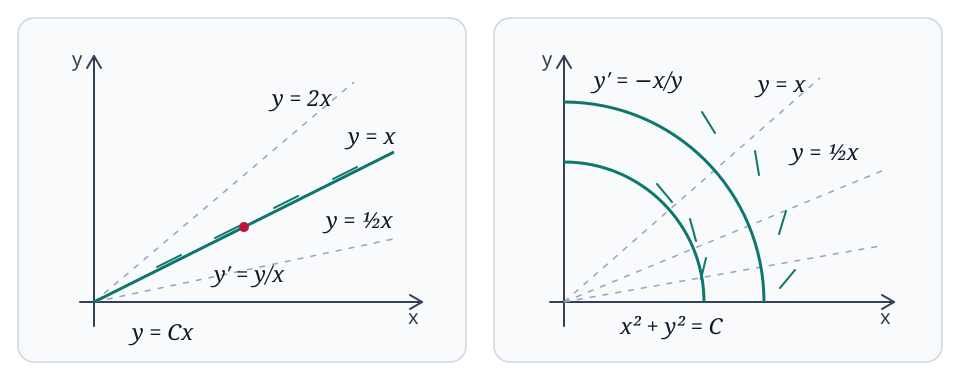

# Models, Geometry, and Well-Posedness

An ordinary differential equation describes how a quantity changes along one independent variable. This chapter develops the vocabulary needed to read such equations, connects equations with direction fields and phase space, and separates three questions that are often confused: whether a solution exists, whether it is unique, and whether it has an elementary formula.

## Differential Equations as Models

!!! definition "Definition (Ordinary differential equation)"
    
    An **ordinary differential equation** (ODE) is an equation involving an unknown function of one independent variable and one or more of its derivatives.

    For example, if $y(t)=t^2$, then

    $$
    y'(t)=2t,
    \qquad
    \int 2t\,dt=t^2+C.
    $$

    In an equation such as

    $$
    y'(t)=y(t)+2t,
    $$

    the unknown function occurs in the law governing its own rate of change.

The same mathematical language describes systems from mechanics, population dynamics, and heat transfer.

!!! example "Example (Free fall and linear drag)"
    Let $v(t)$ be downward velocity. Without air resistance, Newton's law gives

    $$
    m\frac{dv}{dt}=mg,
    \qquad
    \frac{dv}{dt}=g.
    $$

    If $v=h'$, where $h$ is downward displacement, then $h''=g$. If height is measured upward instead, the same model is written $y''+g=0$.

    With linear air resistance,

    $$
    m\frac{dv}{dt}=mg-cv,
    \qquad c>0.
    $$

    The equilibrium velocity is $v_\ast=mg/c$. For initial velocity $v(0)=v_0$,

    $$
    v(t)=\frac{mg}{c}+\left(v_0-\frac{mg}{c}\right)e^{-ct/m},
    $$

    so every solution approaches the terminal velocity $mg/c$.

!!! example "Example (Population growth)"
    Unlimited population growth is modeled by

    $$
    P'(t)=rP(t),
    $$

    with solution $P(t)=P_0e^{rt}$. A carrying capacity $K>0$ leads to the logistic model

    $$
    P'(t)=rP(t)\left(1-\frac{P(t)}{K}\right).
    $$

    The factor $1-P/K$ suppresses growth as the population approaches $K$.

!!! example "Example (Mass on a spring)"
    Hooke's law gives

    $$
    mx''(t)=-kx(t),
    \qquad k>0,
    $$

    or $x''+(k/m)x=0$. Its general solution is

    $$
    x(t)=A\cos(\omega t)+B\sin(\omega t),
    \qquad
    \omega=\sqrt{\frac{k}{m}},
    $$

    and the period is $T=2\pi/\omega$.

!!! example "Example (Newton's law of cooling)"
    If $T_a$ is the ambient temperature, then

    $$
    T'(t)=-k\bigl(T(t)-T_a\bigr),
    \qquad k>0.
    $$

    Thus the temperature difference $T-T_a$ decays exponentially.

These examples suggest three complementary ways to study an ODE.

+ **Analytic methods** seek exact or implicit formulas.
+ **Qualitative methods** infer monotonicity, equilibria, oscillation, and long-time behavior without solving explicitly.
+ **Numerical methods** approximate a selected solution from initial data.

## Order, Linearity, and Solutions

!!! definition "Definition (Order)"
    
    An equation

    $$
    F\bigl(x,y,y',\ldots,y^{(n)}\bigr)=0
    $$

    is an **$n$th-order ODE** if $y^{(n)}$ is the highest derivative present.

!!! definition "Definition (Linear ODE)"
    
    An $n$th-order ODE is **linear** if it can be written

    $$
    a_n(x)y^{(n)}+a_{n-1}(x)y^{(n-1)}+\cdots+a_1(x)y'+a_0(x)y=b(x).
    $$

    Otherwise it is **nonlinear**. Linearity concerns the unknown function and its derivatives; the coefficient functions $a_j(x)$ may depend on $x$.

!!! example "Example (Linear and nonlinear equations)"
    The equations $y'=xy$ and $y'=x^2$ are linear. The equations

    $$
    y'=y^2,
    \qquad
    yy'=x,
    \qquad
    y''=y^2+x+\sin(y')
    $$

    are nonlinear. The functional equation $y'(x)=y(y(x))$ is not an ODE in the preceding sense, because it evaluates $y$ at the unknown point $y(x)$ rather than only at the independent variable $x$.

!!! definition "Definition (Solution and interval of existence)"
    
    A sufficiently differentiable function $y=\phi(x)$ is a **solution** of

    $$
    F\bigl(x,y,y',\ldots,y^{(n)}\bigr)=0
    $$

    on an interval $J$ if

    $$
    F\bigl(x,\phi(x),\phi'(x),\ldots,\phi^{(n)}(x)\bigr)=0
    \qquad (x\in J).
    $$

    The interval $J$ is part of the solution data: a formula may cease to define a solution at a singular point or at a finite-time blow-up.

!!! definition "Definition (Special and general solutions)"
    
    A **special solution** contains no free constants. A family

    $$
    y=\phi(x;c_1,\ldots,c_n)
    $$

    is a **common solution** when every member solves the equation on $J$. It is a **general solution** of an $n$th-order equation when, in addition, the constants are independent in the sense that

    $$
    \det\frac{\partial(\phi,\partial_x\phi,\ldots,\partial_x^{n-1}\phi)}
    {\partial(c_1,\ldots,c_n)}\neq 0.
    $$

    A general solution need not contain every exceptional or singular solution of a nonlinear equation.

!!! example "Example (Free fall as a general solution)"
    For $y''(t)+g=0$,

    $$
    y(t;c_1,c_2)=c_1+c_2t-\frac{g}{2}t^2.
    $$

    Moreover,

    $$
    \det\frac{\partial(y,y')}{\partial(c_1,c_2)}
    =\det\begin{pmatrix}1&t\\0&1\end{pmatrix}=1,
    $$

    so $c_1,c_2$ are independent.

!!! definition "Definition (Initial value problem)"
    
    An **initial value problem** (IVP) for an $n$th-order ODE consists of the equation together with

    $$
    y(x_0)=y_0,
    \quad
    y'(x_0)=y'_0,
    \quad\ldots\quad,
    y^{(n-1)}(x_0)=y^{(n-1)}_0.
    $$

    If a unique solution exists, these $n$ conditions determine the $n$ free constants locally.

The reverse problem is also useful: a family of curves can determine an ODE by eliminating its parameters.

!!! example "Example (Eliminating parameters)"
    Consider $y=c_1x+c_2x^2$. Differentiation gives

    $$
    y'=c_1+2c_2x,
    \qquad
    y''=2c_2.
    $$

    Eliminating $c_1,c_2$ yields

    $$
    x^2y''-2xy'+2y=0.
    $$

    The parameter Jacobian is $x^2$, so the family is regular on intervals not containing $x=0$.

## Integral Curves and Direction Fields

For a first-order equation in explicit form,

$$
y'=f(x,y),
$$

the value $f(x,y)$ prescribes a slope at every point where it is defined. This geometric information remains available even when no explicit solution formula is known; for instance, $f(x,y)=\sin(xy^2)$ already determines a direction field.

!!! definition "Definition (Integral curve)"
    
    If $y=\phi(x)$ solves $y'=f(x,y)$ on an interval $J$, then

    $$
    \Gamma=\{(x,\phi(x)):x\in J\}
    $$

    is its **integral curve**.

!!! remark "Remark (Tangent line)"
    
    At $(x_0,y_0)=(x_0,\phi(x_0))\in\Gamma$, the tangent line is

    $$
    y-y_0=f(x_0,y_0)(x-x_0).
    $$

!!! definition "Definition (Direction field and isocline)"
    
    The **direction field** of $y'=f(x,y)$ assigns slope $f(x,y)$ to the point $(x,y)$. A level curve

    $$
    f(x,y)=k
    $$

    is an **isocline**: every direction element on it has the same slope $k$.

!!! theorem "Theorem (Geometric characterization of solutions)"
    
    A differentiable graph $\Gamma=\{(x,\phi(x)):x\in J\}$ is an integral curve of $y'=f(x,y)$ if and only if its tangent slope at every point $(x,\phi(x))$ equals $f(x,\phi(x))$.

??? proof "Proof"
    If $\phi$ is a solution, then $\phi'(x)=f(x,\phi(x))$, which is exactly the tangent slope of its graph. Conversely, if the tangent slope has this value at every point, then the same identity shows that $\phi$ satisfies the ODE on $J$.

!!! example "Example (Rays)"
    For $y'=y/x$, the isoclines are the rays $y=kx$. The slope of each ray is also $k$, so the integral curves are

    $$
    y=Cx
    $$

    on intervals that do not cross $x=0$, where the differential equation is undefined.

!!! example "Example (Concentric circles)"
    For $y'=-x/y$, direction elements are perpendicular to radial lines from the origin. Rewriting the equation as

    $$
    x\,dx+y\,dy=0
    $$

    and integrating gives

    $$
    x^2+y^2=C.
    $$

    Thus the integral curves are arcs of circles centered at the origin; the graph form breaks down where $y=0$.

<figure markdown="span">
  
  <figcaption>Two equations from the lecture notes: directions tangent to rays for $y'=y/x$, and tangent to circles for $y'=-x/y$.</figcaption>
</figure>

Direction fields also motivate numerical approximation. Euler's method follows the local tangent over a short step:

$$
x_{n+1}=x_n+h,
\qquad
y_{n+1}=y_n+h f(x_n,y_n).
$$

!!! example "Example (Two Euler steps)"
    For $y'=y$, $y(0)=1$, and step size $h=1/4$,

    $$
    (x_0,y_0)=(0,1),
    \quad
    (x_1,y_1)=\left(\frac14,\frac54\right),
    \quad
    (x_2,y_2)=\left(\frac12,\frac{25}{16}\right).
    $$

    The approximation $25/16=1.5625$ is below the exact value $e^{1/2}\approx1.6487$. Decreasing $h$ usually improves the approximation, but a complete error analysis requires additional hypotheses on $f$.

## Phase Space

A higher-order scalar equation can be rewritten as a first-order system. If

$$
y^{(n)}=G\bigl(x,y,y',\ldots,y^{(n-1)}\bigr),
$$

set

$$
u_1=y,
\quad
u_2=y',
\quad\ldots\quad,
u_n=y^{(n-1)}.
$$

Then

$$
u_1'=u_2,
\quad\ldots\quad,
u_{n-1}'=u_n,
\qquad
u_n'=G(x,u_1,\ldots,u_n).
$$

The vector $u=(u_1,\ldots,u_n)$ is the **state**, and the space of all states is the **phase space**. A single point in phase space records exactly the initial data required for the normal-form equation.

!!! example "Example (Harmonic oscillator in phase space)"
    For $mx''=-kx$, put $v=x'$. Then

    $$
    x'=v,
    \qquad
    v'=-\frac{k}{m}x.
    $$

    Along a solution,

    $$
    E(x,v)=\frac12mv^2+\frac12kx^2
    $$

    is constant, because $dE/dt=mv v'+kx x'=0$. Hence nonzero phase trajectories are ellipses. The graph $t\mapsto x(t)$ oscillates, while the phase trajectory records position and velocity simultaneously.

## Recognizing Solvable Forms

The word *solve* can mean an explicit formula, an implicit relation, a convergent approximation, or a qualitative description. These outcomes should not be conflated.

!!! definition "Definition (Separable equation)"
    
    A first-order equation is **separable** if it has the form

    $$
    y'=g(x)h(y).
    $$

    On a region where $h(y)\neq0$, it can be written

    $$
    \frac{dy}{h(y)}=g(x)\,dx.
    $$

    Any equilibrium satisfying $h(y)=0$ must be checked separately, because division by $h(y)$ removes it from the calculation.

!!! example "Example (Solving the logistic model)"
    For $0<P_0<K$, separate variables in

    $$
    P'=rP\left(1-\frac{P}{K}\right),
    \qquad
    P(0)=P_0.
    $$

    Partial fractions give

    $$
    \int\frac{dP}{P(1-P/K)}
    =\int\left(\frac1P+\frac1{K-P}\right)dP
    =rt+C.
    $$

    Therefore

    $$
    \log\frac{P}{K-P}=rt+C,
    $$

    and

    $$
    P(t)=\frac{K}{1+\left(\frac{K-P_0}{P_0}\right)e^{-rt}}.
    $$

    The constant solutions $P\equiv0$ and $P\equiv K$ were excluded during division and must be restored. For $0<P_0<K$, the solution increases and approaches $K$.

An equation in symmetric form

$$
P(x,y)\,dx+Q(x,y)\,dy=0
$$

is **exact** when it equals $d\Phi(x,y)=0$ for some potential $\Phi$. Its solutions are then the level curves $\Phi(x,y)=C$. The circle equation above is exact with $\Phi=(x^2+y^2)/2$. First-order linear equations form another important solvable class, developed in the next chapter of the course.

Closed form is much more restrictive than existence. The equation

$$
y'=x^2+y^2
$$

has a locally unique solution through every initial point, yet its general solution is not obtainable by elementary quadrature. Direction fields, comparison arguments, series, and numerical methods are therefore not substitutes of last resort; they are central ways of understanding ODEs.

## Existence, Uniqueness, and Maximal Intervals

For an IVP $y'=f(x,y)$, $y(x_0)=y_0$, ask three questions in order.

1. **Existence:** is there at least one solution through $(x_0,y_0)$?
2. **Uniqueness:** is there at most one such solution?
3. **Continuation:** how far can that solution be extended?

!!! example "Example (No real solution)"
    The equation

    $$
    (y')^2+1=0
    $$

    has no real-valued solution. Likewise, $y'=1/x$ cannot have an IVP based at $x_0=0$, because the right-hand side is not defined there.

!!! example "Example (Nonuniqueness)"
    The IVP

    $$
    y'=y^{2/3},
    \qquad
    y(0)=0
    $$

    has both $y_1(x)\equiv0$ and $y_2(x)=x^3/27$ as solutions. More generally, for every $a\ge0$,

    $$
    y_a(x)=
    \begin{cases}
    0,&x\le a,\\
    (x-a)^3/27,&x>a
    \end{cases}
    $$

    also satisfies the same initial condition. The right-hand side is continuous, but it is not locally Lipschitz in $y$ at $y=0$.

!!! remark "Remark (A preview of the local theory)"
    
    Continuity of $f$ near $(x_0,y_0)$ is enough for local existence, but not for uniqueness. A local Lipschitz bound in the $y$ variable,

    $$
    |f(x,y_1)-f(x,y_2)|\le L|y_1-y_2|,
    $$

    guarantees local uniqueness. In particular, a continuous partial derivative $\partial f/\partial y$ near the initial point gives such a bound. The Picard theorem later in the course makes this statement precise and proves it by successive approximation.

    Since $f(x,y)=x^2+y^2$ is smooth, its IVP is locally unique despite the absence of an elementary solution formula.

!!! example "Example (Finite-time blow-up)"
    The IVP

    $$
    y'=y^2,
    \qquad
    y(0)=1
    $$

    has the unique solution

    $$
    y(x)=\frac{1}{1-x}.
    $$

    Its maximal interval through $0$ is $(-\infty,1)$. Local existence and uniqueness do not imply that a solution exists for all time.

The practical lesson is that an ODE is more than a symbolic integration problem. Its geometry, initial data, regularity, and interval of definition are part of the problem from the beginning.

## References

+ *Ordinary Differential Equations*, lecture notes, Sections 1.0--1.2.
+ 柳彬，《常微分方程》，北京大学出版社，2021，第 1 章，并参考第 3 章关于存在性与唯一性的例子。
